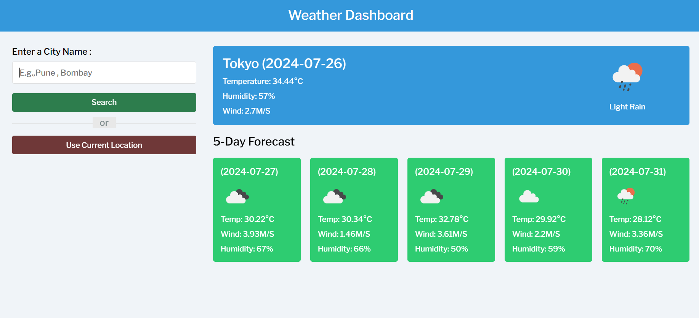

# Weather-Dashboard

**Weather-Dashboard** is a web application that provides real-time weather data. With a user-friendly interface, users can access weather information for any location by typing the location name or using their current location. The application leverages the OpenWeatherMap API to fetch and display weather data.

## Features

- **Real-Time Weather Data**: Displays current weather information including temperature, humidity, and weather conditions.
- **Current Location**: Users can view weather data for their current location with a single click.
- **Search Functionality**: Allows users to search for weather information in different locations by typing the location name.
- **Error Handling**: Provides alert messages when the user types an incorrect or invalid location.

## Note 
To use the OpenWeatherMap API, you need your own API key. Sign up at OpenWeatherMap to get your API key and replace YOUR_API_KEY in the JavaScript file with your actual API key.
IMP: I have deactivated my API key for security reasons.

## Output

